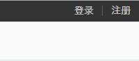

# 胡可第四周作业

***

##### 备忘录

* 安装依赖（less, anywhere, jade）

这几个比较常用，所以装到了全局

    npm install -g less
    npm install -g anywhere
    npm install -g jade

*补充*

命令行中使用JADE进行编译(不压缩/开启监视)

	jade -P -w index.jade

浏览器中使用LESS进行预处理

	<link rel="stylesheet/less" type="text/css" href="styles.less" />
	
	
使用anywhere启动本地服务器，解决开发环境下跨域访问问题

	anywhere 8860	

## 简易拉勾网项目设计说明

### 1.核心功能

***

* *Level 1* - 【进行中】使用模板引擎和CSS预编译语言，完成html设计

* *Level 2* - 使用基于Node.js的简易服务器，动态生成网页

* *Level 2* - 所有数据均为动态绑定，从数据库里出来

* *Level 3* - 实现一套CMS

* *Level 4* - 实现响应式和移动端（拉勾网为了节约流量并没有实现响应式，而是单独做了一套手机端网页）

### 2.技术选型

***

#### 前端：

* Jade（通过其与后端配合实现页面组件的模块化）
* Less（实现CSS样式的整合与分离）
* jQuery（方便基础操作）

#### 服务器

* Express

#### 数据库

* MongoDB

#### 移动端

* Ionic

#### 工具及环境

* Linux(发行版Fedora)
* Sublime Text 3
* AlloyDesigner

### 3.页面分析

***

#### 复用部分

1.头部（除注册和登录页）

2.底部（除注册和登录页）

3.回到页首+反馈（除注册和登录页）

4.底部登陆条（除注册和登录页和职位搜索）

5.页码（职位搜索页/公司页）

6.颜色

* 主题绿 `#05eaaf`

* 主题灰 `#555`

* 主题黑 `#333`

* 主题黄 `#fa6041`

* 字体未选中灰 `#999`

* 背景灰 `#fafafa`

* 边框头灰 `#d2d2d2`

* 边框底灰 `#e5e5e5`

* 虚线灰 `#e1e1e1`

*拉勾网中灰色用的比较混乱，目前浅灰色（看不出明显区别的浅灰色）已经见过不下5种，实际制作中我们将精简它们为一种灰色*

7.字体

* 字体集 

	"Hiragino Sans GB","Microsoft Yahei",SimSun,Arial,"Helvetica Neue",Helvetica
	
* 默认字号 `14px`

* 默认大字号 `18px`

* 默认小字号 `12px`

* 职位[地点] 薪资 公司 `16px`

#### 首页-独立组件

1.首页-左侧职位选择器

2.首页-中间职位列表页

3.首页-搜索框

4.首页-轮播图

5.首页-推荐公司

6.首页-友情链接

#### 职位搜索-独立组件

1.职位搜索-搜索框

2.职位搜索-过滤器

3.职位搜索-排序器

4.职位搜索-职位列表

5.职位搜索-相关搜索

7.职位搜索-最近浏览

8.职位搜索-QQ群推荐

9.职位搜索-新版APP推荐

#### 职位详情-独立组件

1.职位详情-详情

2.职位详情-公司详情

3.职位详情-相似职位

4.职位详情-面试评价

5.职位详情-看了还会看

6.职位详情-移动端推荐

7.职位详情-一拍推荐

#### 公司页-独立组件

*待补充*

#### 一拍页-独立组件

*待补充*

#### 公司详情页-独立组件

*待补充*

### 4.有趣的问题

***

* 导航栏的语义化: `nav>ul>li`/`nav>dl>dt`/`nav>a`该如何选择
* 清除浮动的几种方法
* CSS3新增选择器
* 文本换行的几种策略
* JADE和LESS的高级功能
* 样式分离与整合
* less模块化
* 使用AJAX技术，做到不刷新页面更改绑定数据
* 初次使用jQuery
* 初次使用Linux(发行版Fedora)作为开发环境
* 解决了openJade(某Linux库)与Jade(Node.js模板引擎)相互冲突覆盖的问题
* 解决了Linux下科学上网的问题